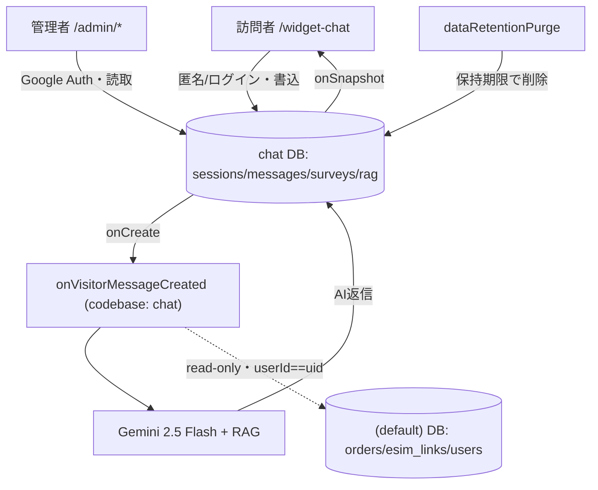

# yah-chat-webdev — シンプル・ミニマル BaaS-first 設計レポート

対象: `/Users/kazuyoshi228/Downloads/yah-chat-webdev` → 新リポ `kazuyoshi228/chat-yah-mobi-v0.2` の `dev` で作業
Firebase: `yah-mobile-v1-3ed24`（yah.mobi 販売サイトと共有）

## 原則（3つ）
1. **ミニマル**: AI チャットサポートに要るものだけ。迷ったら削る。
2. **BaaS-first**: 自前サーバ/SQL ゼロ。Firestore + Cloud Functions + Firebase Auth + 静的 Hosting のみ。
3. **販売サイトを壊さない**（最優先）。

### 🚨 縛り（chat 側しか触らない／販売は read だけ）
- ✅ 触る: chat リポの `functions/`（codebase `chat`）・`chat` DB（read/write）・client。作業は `dev` ブランチ。
- ⛔ **`(default)` DB は read のみ許可**（AI トリガーが顧客データを uid で直接読む）。**write/delete/ルールデプロイは一切しない**。書き込みは `chat` DB のみ。
- ⛔ yah.mobi の**関数（codebase `default`）・ルール・データの変更はゼロ**。chat→販売への呼び出しもゼロ。
- ⛔ 素の `firebase deploy` 禁止。デプロイはユーザーが `--only functions:chat` / `--only firestore:chat`。
- 本番反映（named DB 新設・データ移行・デプロイ・切替）は**ユーザーがコンソール/CLI**。AI はコード＋手順書のみ。

---

## 1. 目標構成（最小）
- 訪問者: `/widget-chat` → **匿名 Auth（一般=RAG のみ）** または **ログイン（本人アカウント＝共有 Auth）** → `chat` DB 書込 → `onVisitorMessageCreated`(Gemini+RAG) → `chat` DB → `onSnapshot` 表示。
- 個別対応（購入/eSIM 状態）: **ログイン時のみ**。AI トリガーが **`(default)` の `orders`/`esim_links`/`users` を `userId==uid` で直接 read**（同期・コピーなし・常に最新）。
- 管理: `/admin/*` → Google（ドメイン制限）→ `chat` DB 読取。
- 定期: `dataRetentionPurge`（保持期限で `chat` DB を削除）。
- **履行系（返金・QR・決済）は全部販売側。chat は非関与**（QR はマイページ案内）。

---

## 2. 撤去（ミニマル化）— まず消す
- `server/`（Express/tRPC/Socket.io/Drizzle）・`drizzle/`・`drizzle.config.ts`・SQL 依存 `scripts/`。
- 死んだ旧 tRPC 画面（`ChatStart`/`ChatRoom`/`ChatWidget`/`ChatListBase`/`ChatDetailBase` ＋ `admin/` の非 Firebase 版一式。`App.tsx` 未参照）。
- `apphosting.yaml` ＋ `firebase.json` の apphosting ブロック。
- server 専用依存（`@aws-sdk/*`・`@upstash/*`・`ioredis`・`jose`・`helmet`・`stripe`・`resend`・`axios`・`dotenv`、dev: `esbuild`・`tsx`・`add`）。
- **Turnstile**（App Check に一本化）・**Upstash レート制限**・**画像/Vision**（復活なし）。
- `checkQrResend`（QR はマイページ）・`refundJob` 系（返金は販売側）。
- **`webhookSync` と同期コレクション**（`purchases`/`esimStatuses`/`customerProfiles` 等）＝**直接 read に置換で不要**。
- 設定整理: `package.json`（`dev`=vite / `build`=vite build / `start`・`db:push` 削除）・`tsconfig`（server 除外）・`vitest`・`.env.example`・`shared/`（server 用削除）。

**管理画面はミニマルに削り切る（決定）**:
- 残す（中核）: KPI・チャット履歴/フィードバック・RAG・クイック返信・フローツリー。
- **削除**: Refund・SystemHealth・Pricing・Customers・Hospitality・SSoT・AiChatbot・UserManuals（対応する `*Firebase.tsx`・`App.tsx` のルート・参照も撤去）。

---

## 3. 分離＝C（保護・最小の追加だけ）
同一プロジェクト内で **Firestore を名前付き DB 2 つに分離**（`(default)`=販売 / `chat`=チャット）。Auth・Functions は共有、Functions は codebase で分ける。
- `chat` DB 新設 → `chat_*` を移行。**顧客データは `(default)` を直接 read（同期・コピーしない）**。
- Functions codebase を **`chat`** に（yah.mobi は `default` 据置＝触らない）。デプロイは `--only functions:chat`。
- rules 分割: `firestore.chat.rules` を `chat` DB にバインド。chat リポは `(default)` ルールを宣言しない。
- 担当: **ユーザー**＝コンソール（DB 新設・移行・デプロイ実行）／**AI**＝コード（`firestore.chat.rules`・`firebase.json`・Functions/クライアントの DB 参照・スコープ付きデプロイスクリプト・手順書）。
- 移行の要注意 = **二重発火の窓**: ①client の書込先を `chat` DB に切替 → ②`(default)` に新規書込が来ない（旧トリガー休眠）を確認 → ③落ち着いてから**古い chat 関数だけ**削除（yah.mobi 不干渉）。

---

## 4. 顧客データ＝`(default)` 直接読み（同期しない）
パーソナライズは維持。**同期・コピーはせず、AI トリガー（Admin SDK）が応答時に `(default)` を read-only で直接引く**。
- 参照（`onVisitorMessageCreated` の顧客コンテキスト構築）:
  - `(default)`/`orders` を `where("userId","==",uid)` → 購入状況
  - `(default)`/`esim_links` を `where("userId","==",uid)` → eSIM 状況
  - `(default)`/`users/{uid}`（＋プロフィール）→ 氏名/言語 等
  - `uid = session.visitorId = request.auth.uid`。**匿名は uid 不一致で何もヒットせず自動的に RAG のみ**。
- 実装（AI・コード）: トリガーの顧客参照を **旧 `customerProfiles/purchases/esimStatuses`（seed）から yah.mobi 実データ `orders/esim_links/users`（`userId`）へ切替**。chat データ書込は `getFirestore(app,"chat")`、顧客 read は default handle。
- 漏洩防止: **AI コンテキスト/プロンプトに載せるのは非機微のみ**（プラン名・状態・期限・データ量）。**決済ID（`stripePaymentIntentId` 等）は載せない**。read は `orders/esim_links/users`＋`userId==uid` に**スコープを絞る**。
- 本人特定＝**ログイン＋uid 照合**（email タイプ照合は漏洩リスクで不採用）。匿名→ログインの遷移は **account linking**（`linkWithCredential`）で `visitorId` 継続。

---

## 5. データモデル & ルール（chat DB のみ）
実コード（`firestore.rules`/`useChatSession.ts`/`useChatMessages.ts`/`firestore.indexes.json`）準拠。`chat` DB には chat 自身のデータだけを置く（**顧客データは持たない＝(default) 直接 read**）。書込者: 訪=匿名/ログイン訪問者・管=admin・Fn=Functions（Admin SDK＝ルール **バイパス**）。

| コレクション | 主フィールド | create | read | upd/del |
|---|---|---|---|---|
| `chat_sessions/{sid}` | visitorId(=uid)/status/language/createdAt/(endedAt,escalated,summary,scheduledDeleteAt=Fn) | 認証本人・status=active | 本人\|admin | 本人(→ended のみ)/✗ |
| `…/chat_messages` | role(visitor\|admin\|ai)/content(1–2000)/createdAt | セッション本人・role=visitor | 本人\|admin | ✗/✗ |
| `chat_surveys` | rating(1–5)/createdAt | 認証 | admin | ✗ |
| `chat_flow_nodes`・`chat_quick_replies` | 多言語 label/content 等 | admin | 認証 | admin |
| `chat_rag_documents`(embedding Vector768,Fn自動)・`chat_hospitality_guidelines`・`chat_agent_logs` | — | admin | admin | admin |
| `users/{uid}` | role='visitor'/createdAt | 本人・最小のみ | 本人\|admin | ✗ |
| 未定義 | — | ✗ | ✗ | ✗（default deny） |
- index: `chat_sessions` visitorId+createdAt / status+createdAt / escalated+createdAt。
- 🔴 **要修正**: `chat_sessions`/`chat_messages` の create は `hasAll` 止まり → **`hasOnly`＋値検証**に厳格化（訪問者の余計フィールド注入を防ぐ）。
- `firestore.chat.rules` から旧「同期系（plans/purchases/esim*/customerProfiles）」ルールは削除（chat DB に無いため）。

---

## 6. 外部（要点）
- **ウィジェット** `/widget-chat`: 匿名/ログイン Auth → デシジョンツリー(`chat_flow_nodes`) → AI(Gemini+RAG) → 終了 → アンケート(1–5)。状態: loading/typing/ended/error/empty。**QR はマイページ案内**。
- **i18n**: 6 言語(en/ja/zh/ko/th/vi・`shared/i18n.ts`)、`localStorage`→`navigator.language`→en。フロー/RAG は `parseI18n`。
- **連結＝埋め込みウィジェット（確定）**: 薄いローダー `<script>` ＋ iframe パネル（Intercom 型）。`chat.init({ lang })` → iframe `?lang=`（lang param 追加）。開閉/リサイズは postMessage（origin 検証）。iframe 内で**自前 Auth**（匿名／必要時ログイン）。framing 許可は `firebase.json` headers（`frame-ancestors`）。iframe 元ドメインを App Check/reCAPTCHA 許可に登録。→ 販売サイトと **DOM/CSS/JS/Firebase を分離**＝縛りと一致。NPM/React 直結は不採用。

---

## 7. App Check（BaaS ネイティブの入口保護）
- **reCAPTCHA Enterprise**（プロジェクト既存を再利用）で訪問者の直書き入口を守る＝コスト濫用/スパム防止。Turnstile は撤去。
- AI: `firebase.ts` に App Check 初期化・`.env.example` に site key・emulator は debug token。
- ユーザー(コンソール): chat ドメインを許可＋アプリ登録。**⚠ project の enforcement 設定は触らない**（yah.mobi 影響）。**要確認**: Firestore enforcement が named DB 単位か。
- コスト保護: `onVisitorMessageCreated` に軽量レート制限（Firestore カウンタ）。
- 整理: App Check＝「本物のアプリか」／authZ＝Firestore ルール（別レイヤ）。

---

## 8. 遷移図 & 旧→新 対応表
既存 `screen-flow*.mmd` は旧構成（`/portal`・`/ops` 等）で陳腐化 → 下図で置換。

> chat の書込は **`chat` DB のみ**。`(default)` は **read だけ**（顧客データを uid 照合）。write/delete/deploy はゼロ。履行（返金/QR/決済）は販売側。

| 旧 | 新 |
|---|---|
| tRPC / Socket.io / OAuth+JWT / Drizzle+MySQL | Firestore 直読み+Callable / onSnapshot / Firebase Auth / Firestore `chat` DB |
| refundJob / healthCheck+llmJudge / upload+Vision / App Hosting | 販売側 / 廃止 / 撤去 / 静的 Hosting |
| webhookSync / 同期コレクション | 廃止（顧客データは `(default)` 直接 read） |
| `/portal`・`/chat`・`/ops/*` | `/checkin`・`/widget-chat`・（廃止） |
| 旧 MySQL `chat_*` テーブル | `chat` DB 同名コレクション |

---

## 9. 進め方 & 検証
Phases（`dev` ブランチ・保護を先に）:
0. リポ移送（現状 push → `dev`・新 origin）。
1. **分離（保護）**: AI=コード（`firestore.chat.rules`/`firebase.json`/DB参照/ガード/手順書、トリガーの顧客参照を `orders/esim_links/users` へ切替）、ユーザー=コンソール（DB 新設・移行・scoped デプロイ）。
2. **撤去**: server/drizzle/dead UI/apphosting/deps/turnstile/upstash/webhookSync/config。
3. **仕上げ**: App Check・`hasOnly` 厳格化・軽量レート制限・管理画面の削減。
4. **ドキュメント**: `CLAUDE.md`＋`docs/design_*.md`。
5. **検証**。

検証: `pnpm install` → `tsc --noEmit` → `pnpm test` → `pnpm build`(vite・server バンドル無) → `npm --prefix functions run build` → エミュレータで `/widget-chat`(ログイン→個別回答が `(default)` read で出る) と `/admin`(読取) → `grep -rE "@trpc|drizzle|/server/"` が 0件 → ガードレール目視（`firebase.json` に `(default)` ルール/他 codebase 無し）。本番反映はユーザー指示で。

---

## 10. 決定済み ＋ 残る確認
**決定済み**: パーソナライズ=**維持**／顧客データ=**`(default)` 直接 read（同期しない）**／本人特定=**ログイン＋uid 照合**（匿名は RAG のみ）／管理画面=**中核のみに削り切る**／連結=**ウィジェット（ローダー＋iframe）**／ガードレール=**`(default)` は read のみ許可**（write/delete/deploy 禁止）。

**残る確認（chat 実装はブロックしない）**:
1. `(default)`/`orders`・`esim_links` の**顧客向けフィールド名/形**（`userId` 前提・プラン名/状態/期限/データ量の実キー）をトリガー実装時に実データで確認。
2. **App Check enforcement のスコープ**（named DB 単位か全体か）＝有効化する側（yah.mobi/コンソール）の運用。chat は実装のみ。
